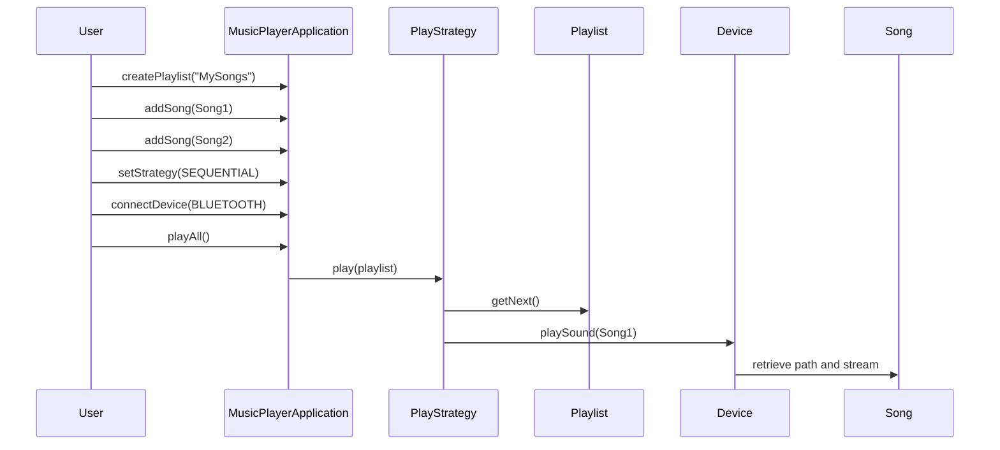

# 🎵 Music Player UML Diagram - In-Depth Explanation

This document thoroughly explains the UML diagram of a **Music Player Application**. It includes the purpose of each class, method responsibilities, design pattern usage, interactions, and logical flow of control.

---

## 🧠 Architectural Overview

This music player system is designed using key **Object-Oriented Programming principles** such as **encapsulation, abstraction, polymorphism**, and **modularity**. It also uses well-established **design patterns** like Singleton, Strategy, Factory, Facade, and Adapter for extensibility, maintainability, and clarity.

The primary functionalities supported are:

- Managing songs and playlists
- Applying different play strategies (e.g., sequential, random)
- Outputting sound through different device types (e.g., headphones, Bluetooth, wired speakers)
- Providing a simple and unified interface to control playback

---

## 📦 Class: `MusicPlayerApplication` (🧩 Singleton + Facade)

### ✅ Purpose:
The **central controller** of the system. Acts as the main entry point that orchestrates all major actions and interactions.

### 🛠️ Responsibilities:
- Holds all loaded songs and manages the current active playlist.
- Handles user operations like `playSong`, `pauseSong`, and `addSong`.
- Manages connected output devices and delegates song playback to them.
- Delegates play logic to different strategies like `SequentialPlay` or `RandomPlay`.

### 🔗 Key Attributes:
- `vector<Song> songs` — All available songs in the app.
- `Playlist playlist` — The currently active playlist.
- `Device device` — The current output audio device.
- `PlayStrategy strategy` — The current play strategy.

### 📦 Key Methods:
- `createPlaylist(String name)`: Creates a new empty playlist.
- `loadPlaylist(String name)`: Loads a playlist by name from storage.
- `addSong(Song song)`: Adds a song to the current playlist.
- `playSong(Song song)`: Plays a specific song using the device and strategy.
- `pauseSong(Song song)`: Pauses a specific song.
- `playAll()`: Plays all songs in the playlist using the current strategy.
- `setStrategy(StrategyType type)`: Changes the playback behavior dynamically.
- `connectDevice(DeviceType type)`: Connects to a specific type of audio device.

### 🔄 Interactions:
- Delegates playback control to the `PlayStrategy`.
- Sends audio output to the selected `Device`.
- Manages `Playlist` object for song navigation.

### 💡 Design Rationale:
- **Singleton** ensures that only one music player instance controls the system.
- **Facade** simplifies user interaction by exposing only the essential functions.

---

## 📦 Class: `Playlist`

### ✅ Purpose:
Represents a **collection of songs** and allows navigation between them.

### 🛠️ Responsibilities:
- Maintains the list of songs in the playlist.
- Tracks the index of the currently playing song.
- Provides song navigation methods.

### 🔗 Key Attributes:
- `vector<Song> songs` — List of songs in the playlist.
- `int currentIndex` — Index of the currently playing song.

### 📦 Key Methods:
- `addSong(Song song)`: Appends a new song to the playlist.
- `hasNext()`: Returns true if there is a next song.
- `hasPrevious()`: Returns true if there is a previous song.
- `getNext()`: Moves the current index forward and returns the next song.
- `getPrevious()`: Moves the current index backward and returns the previous song.

### 💡 Design Rationale:
Encapsulates all logic related to **managing and navigating songs**, which helps separate data storage from control logic.

---

## 📦 Class: `Song`

### ✅ Purpose:
Represents a **musical track** with associated metadata and file path.

### 🛠️ Responsibilities:
- Stores information about each individual song.
- Acts as a data container for playback operations.

### 🔗 Key Attributes:
- `String title` — Song title.
- `String artist` — Artist or band name.
- `String path` — Filesystem path or URL to the song file.

### 📦 Possible Methods:
- `play()`, `pause()`, `getMetadata()` (may be handled via device instead)

### 💡 Design Rationale:
The atomic unit of the system — each song is passed to other components (device, strategy) for playback.

---

## 📦 Interface: `Device` (🔌 Abstract + Factory)

### ✅ Purpose:
Represents an **audio output system** that plays sound.

### 🛠️ Responsibilities:
- Abstract interface for different playback hardware.
- Each subclass implements playback logic according to its technology (Bluetooth, wired, etc.)

### 📦 Method:
- `playSound(Song song)`: Plays audio using that device.

### 📦 Implementations:
- `BluetoothSpeaker`
- `WiredSpeaker`
- `Headphones`

### 💡 Design Rationale:
- The **Factory pattern** is used to instantiate the appropriate device based on the user's choice.
- The **abstract interface** ensures the main application remains device-agnostic.

---

## 🎧 Class: `Adapter` (optional)

### ✅ Purpose:
Provides **compatibility** for devices that don’t natively match the expected interface.

### Example:
A `HeadphonesAdapter` may allow legacy wired headphones to be treated as standard output devices.

---

## 🎛️ Interface: `PlayStrategy` (🔁 Strategy Pattern)

### ✅ Purpose:
Defines **how** songs in a playlist are played — e.g., in order or shuffled.

### 📦 Method:
- `play(Playlist playlist)` — Executes the playlist playback logic.

### 📦 Implementations:
- `SequentialPlay`: Plays songs in order.
- `RandomPlay`: Randomizes the order before playback.

### 💡 Design Rationale:
The **Strategy pattern** allows the playback algorithm to be selected at runtime, promoting open/closed design.

---

## 📦 Enums

### `StrategyType`
Defines available strategies like `SEQUENTIAL`, `RANDOM`, etc.

### `DeviceType`
Defines supported devices like `BLUETOOTH`, `WIRED`, `HEADPHONES`, etc.

---

## 🔁 Complete Flow of Execution

---

## ✅ Summary of Design Patterns

| Pattern      | Purpose                                                  |
|--------------|----------------------------------------------------------|
| Singleton    | Single access point for application logic                |
| Facade       | Provides high-level interface hiding inner complexity    |
| Strategy     | Allows different playback algorithms                     |
| Factory      | Creates appropriate device objects dynamically           |
| Adapter      | Bridges incompatible interfaces (optional)               |

---

## 🔍 Real-World Analogies

- `MusicPlayerApplication` is like the Spotify app UI.
- `Playlist` is your custom music queue.
- `Song` is an MP3 or stream.
- `Device` is your speaker/headphones.
- `PlayStrategy` is how you play songs: normal, shuffle, etc.

---

## 💡 Final Thoughts

This UML design is **highly extensible**. You can easily add features like:
- Song metadata parsing
- Streaming support (e.g., HTTP)
- Equalizer functionality
- Song history or favorite marking

If you’d like to see Java code or testing strategies for this system, just ask!
